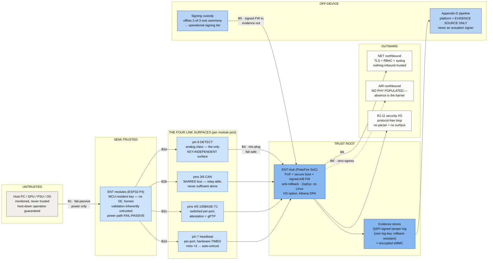
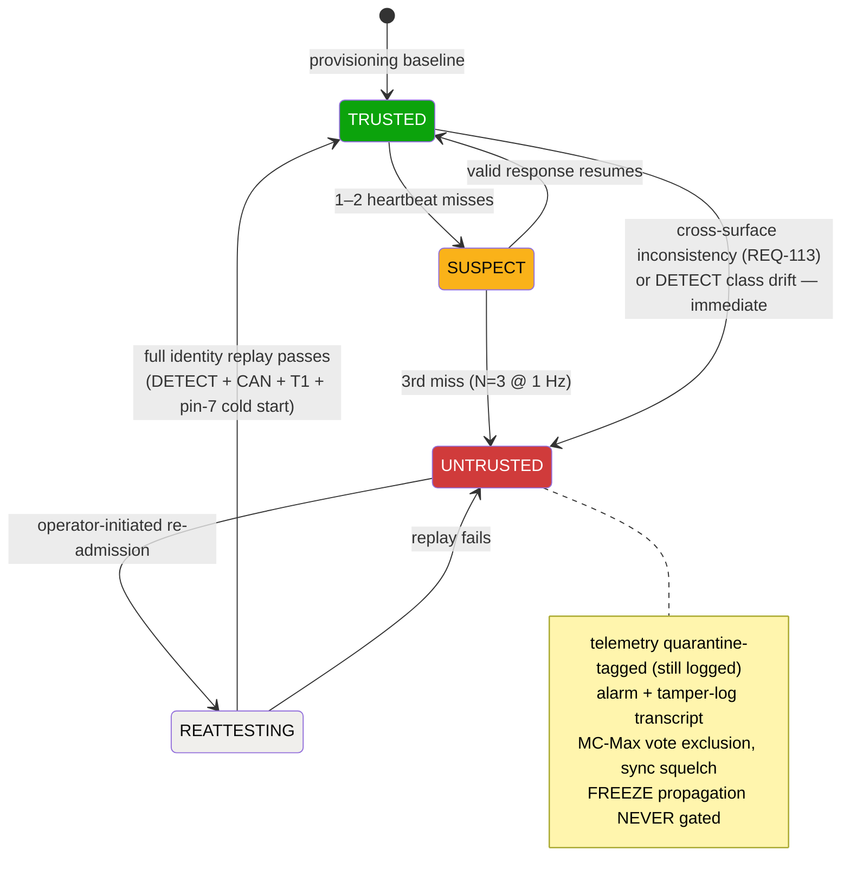
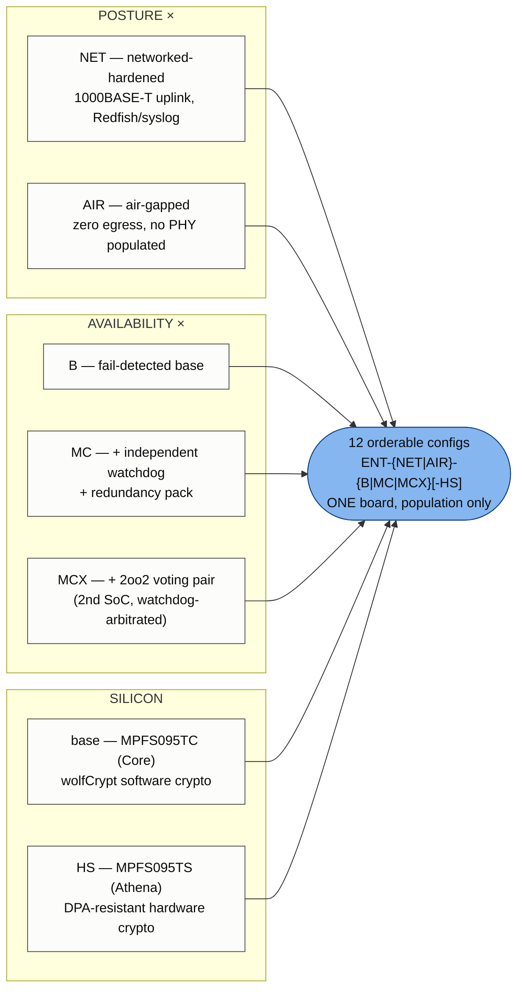

# ENT at a glance — trust barriers + variant map

_DERIVED VIEW (2026-07-02, spec v1.2.0). Canonical sources: `docs/enterprise-security/threat-model-2026-07-02.md`
(honest limits), `docs/enterprise-requirements/` (registers, 114 REQs), `docs/enterprise-requirements/product-matrix-2026-07-02.md`,
spec §13. If this page disagrees with those, THEY win — update this page. Diagrams are
Mermaid (GitHub renders them natively); standalone SVG exports for the customer packet
live at `docs/enterprise-requirements/assets/ent-{trust-zone-map,untrust-state-machine,variant-cube}.svg`._

## 1. The trust-zone map

Trust rises left to right (fill deepens with trust); every arrow is a barrier from the
table in §2.

## 2. The barrier table (what crosses, what enforces, honest limit)

| # | Barrier | What crosses it | Enforced by | Honest limit (threat model is canonical) |
|---|---|---|---|---|
| B1 | Host ↔ module | Monitored power; nothing logical | Fail-passive interposer (REQ-MOD-030); no host-controllable module surface | Module sees only what its sensors see |
| B2a | DETECT (pin 8) | Analog class code + poke-and-ack liveness | Physics of the resistor divider | **Key-independent** (the only one) — but class-level only |
| B2b | CAN (pins 3/6) | Control + telemetry + challenge nonces | Device-key challenge-response | **Shared bus** — any node can answer; relay-able; never sufficient alone for high-trust ops |
| B2c | T1 (pins 4/5) | Streaming, gPTP sync, attestation, FW/evidence transfer | Switched per-port (LAN9370), link attestation | Same device key as CAN — relay-independent only via the port |
| B2d | pin-7 heartbeat | Hardware-timed challenge response (µs window) | Per-port fabric timing capture; miss ×3 → AUTO-UNTRUST | Proves key+port+real-time liveness, **NOT firmware integrity**; extracted key + physical port presence still answers |
| B3 | Module trust state | See the state machine below | Untrust state machine; quarantine-tagged telemetry (still logged); MC-Max vote exclusion | Re-admission = full re-attestation, never heartbeat resumption. FREEZE is NEVER gated by trust state. Legacy modules: permanent class-trust floor |
| B4 | Mis-plug (any RJ-45) | Nothing, by design — live-switch/57 V PoE survivable | Hub: SS110 + SMAJ58A + T1 DC-block caps + pin-7 network; module: TPS26621 auto-retry eFuse | Fail-SAFE, not fail-functional: no signaling under 48–57 V common mode (documented) |
| B5 | Firmware/keys | Signed images in; evidence out | Offline 2-of-3 root → operational tier; monotonic anti-rollback; per-unit keys not rotatable (compromise → untrust path, not rekey) | Base builds: software crypto (wolfCrypt), **no DPA claim** — HS option (Athena) restores it |
| B6 | Northbound (NET) | Telemetry/events out; signed OTA + authenticated mgmt in | TLS, RBAC, config audit log | The hub is a data SOURCE; nothing inbound is trusted without signature/authn |
| B6' | Northbound (AIR) | Nothing — zero egress BY DESIGN | **No network PHY populated** — inspection-verifiable | Optional customer-attached KVM = outside the guarantee |
| B7 | MC-Max internal | Voted outputs only: tamper-log writes + Appendix-D actuation triggers | 2oo2 pair + independent watchdog arbiter (own clock/rail); checkpointed, NOT lockstep | Identical-firmware common-mode faults not covered (N/N-1 staging mitigates) |

**The B3 trust state machine** (status colors carry state, labels carry meaning):

**Surface-independence rule (REQ-113):** every module is validated on ≥2 independent
surfaces. Only DETECT is *cryptographically* independent (no key). CAN/T1/pin-7 share the
device key — pin-7 adds *relay* independence (timing), not key independence. A stolen key
defeats B2b/c/d together but must still answer from the physical port in hardware time.

## 3. The variant map

Three orthogonal axes, one PCB, population-differentiated — `ENT-{NET|AIR}-{B|MC|MCX}[-HS]`:

| Hub SKU | Uplink | Watchdog | Voting pair | RJ-11 | eMMC | Parts floor* |
|---|---|---|---|---|---|---|
| NET-B | 1× 1000BASE-T | — | — | on request | 8 GB | $214–274 |
| NET-MC | 2× | ● | — | on request | 8 GB | $239–307 |
| NET-MCX | 2× | ● | ● | on request | 8 GB | $394–507 |
| AIR-B | **no PHY populated** | — | — | ● | 32/64 GB | $198–256 |
| AIR-MC | none | ● | — | ● | 32/64 GB | $206–273 |
| AIR-MCX | none | ● | ● | ● | 32/64 GB | $356–466 |

_*100q cost floors [est/RFQ], never prices. Every SKU: 8 ports (CAN + per-port T1 + per-port pin-7),
QSPI tamper log, 3-source eFuse power w/ FULL/STANDBY postures, mis-plug fail-safe, signed A/B FW._

**Modules** — one radio-free ENT build per family (ESP32-P4 + T1 + DETECT 10 kΩ +
heartbeat responder on all five):

| Module SKU | Sensing | Distinctive | Parts class |
|---|---|---|---|
| 24-pin ATX | 4× INA228 energy counters | Bulk-5VSB source, mezzanine base, the fleet's power-signature validator | ~$40–42 |
| EPS 8-pin | INA238 ×2 + INA240 + ADS131M08 | 2-cable interposer | ~$45–52 |
| PCIe 2-port | as EPS | GPU-rail pre-roll, per-cable attribution | ~$45–52 |
| PCIe 3-port | as EPS +1 cable | spec upper bound | ~$49–58 |
| 12VHPWR | 6× per-pin INA240 + LTC2358-18 | flagship forensics, pin-hog alarm | ~$99–102 |

**Cross-tier guarantee:** any module works in any hub (locked). ENT module on a consumer
hub → T1/heartbeat/sync dormant, CAN full. Consumer module on an ENT hub → CAN full,
RS-485 dark (T1-only), class-level trust floor. Full per-unit trust needs ENT modules.
