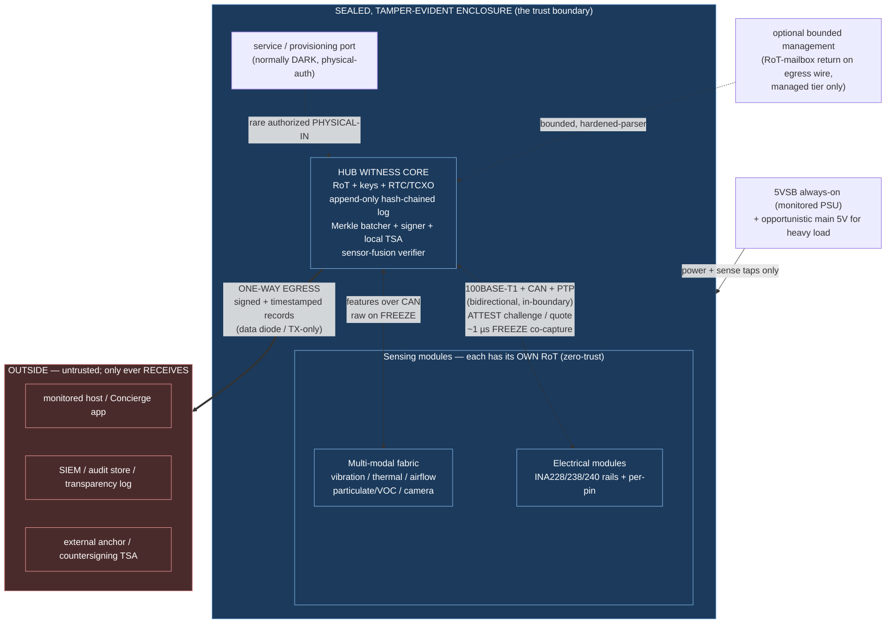
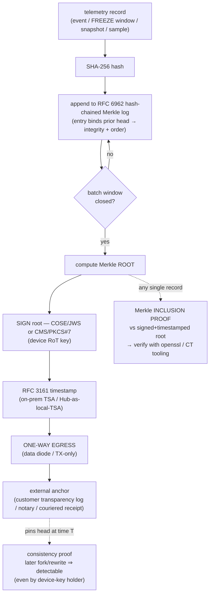
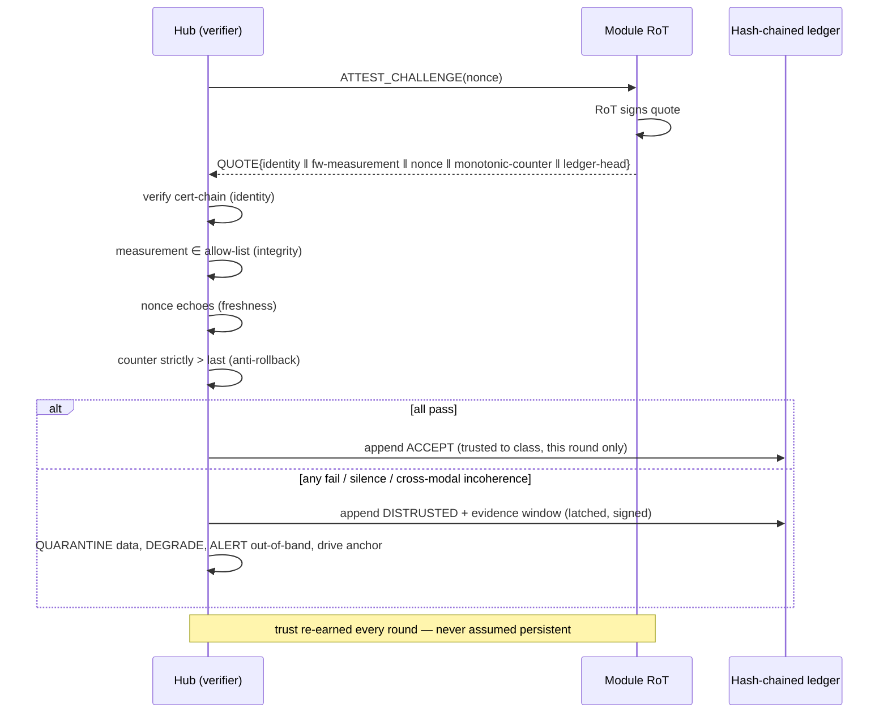
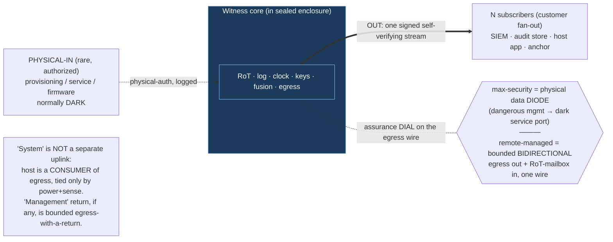

# CEC Enterprise / Workstation TRUST Tier — Whitepaper Outline (for expert review)

**Status: PROPOSED — resolves-toward OQ-7 (Enterprise build).** Folds OQ-44 (identity/provenance),
OQ-47 (cross-domain timebase), OQ-50 (trust/privacy boundary), OQ-62 (plan signing). This outline
summarizes the design in `docs/enterprise-workstation-trust-addendum-2026-06-30.md`; the
`CEC-Platform-Ground-Truth-Spec.md` remains ground truth and precedes both. Nothing here is a lock;
items marked PROPOSED / exploratory are not committed and await owner ratification. For expert
red-team review — §10 and §14 carry the adversarial analysis.

---

## 1. Executive summary / thesis

- A **sealed, tamper-evident, host-independent hardware WITNESS** that records a workstation's
  power/telemetry into an **append-only, hash-chained, device-RoT-signed, RFC-3161-timestamped log**.
- Core promise: *"this telemetry stream, in this order, existed at these times, on this attested
  device, unaltered"* — provable **independent of the host**, which is presumed compromisable.
- **Zero-trust extends to our own modules:** every sensing module has its OWN root of trust and is
  **continuously attested** — *do not trust the module just because it is reporting.*
- A **multi-modal in-case sensor fabric** (vibration / thermal / airflow / particulate / camera)
  cross-correlates on a shared **~1 µs trusted timebase** to catch physical tampering AND a lying module.
- **Minimize ingress:** one-way signed egress; the box's integrity depends only on its own RoT +
  internal sensors. Everything ships in **open standards** (X.509 / RFC 3161 / COSE-CMS / RFC 6962) so
  any external system verifies independently — no proprietary verifier.

## 2. The problem current systems skip

- **Host-side logging can make no claim about itself.** A compromised OS/user can forge, backdate,
  reorder, or silently delete its own records; the log's keys and clock live inside the thing being
  attacked. That gap is the product.
- **"Trusted telemetry" usually still trusts the sensor.** Standard fleets assume a reporting module
  is honest; a subverted module can pass crypto identity and still lie in its payload.
- **Timestamps are the weak seam.** Most records carry a coarse, forgeable host clock with no
  traceability class attached, so a verifier can't tell legal-grade time from a best-effort guess.
- **Physical tamper is unwitnessed.** Nothing correlates a case-open / probe-attach / drill against the
  electrical record on a common timeline.

## 3. Trust model — the independent, host-uncforgeable witness

- The Hub is an **out-of-band recorder** on its **own RoT and timebase**, powered from **5VSB
  (always-on** — survives host off / asleep / compromised; spec §2.9, OQ-1).
- **Threat model (three actors):** (a) compromised host OS/user → cannot forge/alter/backdate/reorder/
  delete (record lives behind the Hub RoT in an append-only chain the host never holds keys to — the
  core promise); (b) physical attacker → tamper-*evident* now, tamper-*responsive* on the certified
  part (key zeroization, §7); (c) device-key holder rewriting history → defeated by **external
  anchoring** of the log head (§6), detectable even by an insider.
- **Trust boundary = the sealed enclosure.** Inside: bidirectional module↔Hub fabric. Crossing out: a
  single one-way signed stream. See Chart 1.

## 4. Tamper-evident record + why it is transport-independent

- Every record (event, FREEZE co-capture window, periodic snapshot, streamed sample) is hashed and
  appended to an **RFC 6962-style hash-chained Merkle transparency log** — each entry binds the prior
  head, so **integrity + monotonic order are cryptographic**.
- Per **batch window** the Merkle **root** is **signed** (COSE/JWS or CMS/PKCS#7) by the device key and
  **timestamped**; any single record proves out via a **Merkle inclusion proof** — no per-record signature.
- **Load-bearing principle — tamper-evidence ⊥ time-traceability.** The chain proves integrity/order
  *unconditionally*, independent of the time source; time only sets the record's *traceability class*
  (§6). So time can degrade to host-asserted and the record is **still provably unaltered and ordered.**
- **Transport-independent:** the record is self-verifying regardless of the wire, so remote management
  or a change of egress medium never weakens the guarantee — it is enforced by the RoT/hardware
  boundary, not by the absence of a channel.

## 5. "Attest everything" is feasible — the Merkle numbers

- You **never sign per-sample**; you sign one root per batch and prove any sample by inclusion. This
  **decouples signing rate from data rate**.
- Worst-case aggregate ~**10 MB/s** (8 Pro ports full-streaming ~900 kB/s each; most builds far below —
  event + 1 kHz averaged). Hashing every byte sits **30–100× under** HW SHA-256 (hundreds of MB/s → GB/s).
- Signing is **one root/batch** (100 ms → 10 sig/s; 10 ms → 100 sig/s) — inside a bare secure element
  (~10–50/s) or trivial on a crypto core. Trust metadata is **<1%** of raw data.
- **Conclusion: 100% of the data can be attested.** The only infeasible variant — a per-raw-sample
  RFC 3161 token — is never needed (the root token covers every sample under it transitively). The one
  design knob is **batch cadence** (tighter = faster time-to-attestation, needs the crypto core).

## 6. Trusted time — a pluggable ladder with per-record class

- A time-source abstraction with **graceful fallback**; every record carries the **class + the proof**,
  so a cross-check system gets graduated, honest trust. The chain (§4) stays intact at every rung.

| Class | Source | Traceability | Notes |
|---|---|---|---|
| **A — traceable/legal** | on-prem **RFC 3161 TSA** (in-enclave; optionally eIDAS-qualified) | Best; legal-grade | token stored per root |
| **B — traceable/local** | **GNSS-disciplined grandmaster** (GPS/GNSS → UTC), PPS in | UTC-traceable | GNSS is an RF ingress + spoofable → opt-in only (§9) |
| **C — disciplined holdover** | Hub **TCXO/RTC**, disciplined while A/B last present, drift-bounded | Bounded uncertainty (recorded) | bridges A/B outages |
| **D — host-asserted** | workstation NTP/NTS, **marked unverified** | None (claim only) | last resort; never blocks logging |

- **Tamper-evidence is separable from time-traceability** (§4): the class only labels the wall-clock
  attribute; the record's integrity + order hold at every rung, including D.
- **Air-gap fit:** A/B live *inside* the enclave (on-prem TSA appliance / GNSS puck); the **Hub can act
  as its own local RFC 3161 TSA** (attested clock + RoT key) — often cleanest for one air-gapped box —
  with traceability then resting on the disciplined clock + external anchor + **customer receive-time**
  on the one-way stream (external UTC anchoring with zero ingress, §9).

## 7. Zero-trust per-module RoT + continuous attestation + assume-bad

- **Every module carries its OWN RoT** (distinct from the Hub's), advertised over DETECT reserved codes
  so the Hub knows a port's attestation strength before the module talks (§16 open decision).
- **Continuous (per-round, not boot-only) attestation:** the Hub challenges each module with a fresh
  nonce; the module RoT signs a quote over {identity ‖ fw-measurement ‖ nonce ‖ monotonic counter ‖
  last-seen ledger head}; the Hub verifies identity (cert chain), integrity (measurement on allow-list),
  freshness (nonce echo), anti-rollback (counter strictly increased). Cadence ~1 s liveness / ~10–60 s
  full re-measure. Monotonic counters are load-bearing (defeat replay/clone/rollback across power cycles).
- **Assume-bad (fail-SAFE):** trust holds ONLY while every check passes; any failure latches a signed
  **DISTRUSTED** state → MARK in the ledger + QUARANTINE the data (zero control authority, retained for
  forensics) + DEGRADE gracefully + ALERT out-of-band + drive the external anchor + RE-ADMIT only on a
  fresh counter-advanced clean attestation (physical-tamper latch also needs human sign-off).

| Rung | Part (~100q) | What it buys | Firmware measurement |
|---|---|---|---|
| **0** | **ATECC608B (~$0.84)** | non-exportable ECC-P256 identity + ECDSA challenge/response + monotonic counters; crypto tamper-EVIDENCE | MCU-self-asserted (no PCR) — volume floor |
| **1** | **SE050 (~$2.84)** | + active tamper-DETECT zeroization + I2C secure channel (defeats bus MITM) | still MCU-asserted |
| **2** | **OPTIGA TPM SLB9673 (~$4.2)** | + measured-boot PCR banks + standards-clean TPM2 quote | first **independent** fw measurement (Enterprise-module RoT on the P4 Hub) |
| **3** | **on-die PolarFire** | PUF keys (never stored) + DPA-resistant secure boot + tamper-mesh zeroization | only tamper-RESPONSIVE rung + FIPS/CC carrier |

## 8. Multi-modal cross-correlation = the module-lie detector

- **Cross-correlation = coincidence, not any single trip.** A real tamper radiates a COHERENT signature
  across orthogonal physics in the co-capture window; spoofing requires injecting energy coherent across
  *every* modality on *every* module on the ~1 µs timebase — which IS the tamper event. Direct sensor
  attacks self-incriminate (covered lens = exposure collapse; replayed frame fails the IR-strobe
  challenge; swapped 1-Wire node fails SHA-256-HMAC).
- **The same fusion is the zero-trust module-lie detector.** A module can pass crypto and still lie in
  payload; the auditors are **separate modules with separate RoTs sensing independent physics**, and the
  checks run on the **Hub** (verifier), so no compromised module can suppress them. *Crypto proves
  who/what a module is; cross-modal fusion proves it is telling the truth about the physical world.*
- Runs on the LOCKED CAN FREEZE ~1 µs co-capture (spec §6.10) + PTP on 100BASE-T1 — **no respin**; sensor
  INT pins OR into the same FREEZE the INA sensors already use.

| Physical law (auditor ⟂ claim) | What a violation catches |
|---|---|
| **Thermal ⟂ claimed I·V** | under-reported current that can't cool away an implant's heat → hotspot on a node the liar doesn't own |
| **Vibration/acoustic ⟂ load transients** | big electrical event with flat coil-whine = a lie; added clip mass detunes fan-driven modal peaks (probe-attach) |
| **Airflow/fan ⟂ power + thermal** | plugged vent / spoofed fan-state; power+thermal that don't match airflow |
| **Particulate/VOC ⟂ thermal event** | **the 12VHPWR melt case** — a failing pin arcs and outgasses while per-pin current still looks balanced → caught before melt |
| **Camera ⟂ everything** | LED dark vs "healthy", board absent vs "present", case-open exposure spike |

## 9. Minimize ingress — the two boundary crossings

- **Governing principle:** every input is attack surface AND a standing dependency → drive ingress to
  near zero. Integrity depends ONLY on the Hub RoT + internal sensors, never on host/outside input.
- **Inside the enclosure** the module↔Hub fabric stays **bidirectional** (Hub challenges modules; §7) —
  all within the trust boundary, fine. **Crossing out is ONE-WAY EGRESS ONLY** (a data diode): signed,
  timestamped records go out; nothing comes back (no queries, config, commands, firmware).
- Everything that looks like it needs a return path resolves without one: freshness is **self-generated**
  (RoT TRNG nonce + counter + own clock, pushed); timestamping is the **Hub-as-local-TSA**; UTC traceability
  is the **customer's receive-time** on the stream; "on-demand upload" becomes autonomous egress; anchoring
  is fire-and-forget; **firmware/config is physical, authenticated, rare, logged — never through the uplink.**
- **Count crossings, not ports:** the naive three uplinks (system + egress + management) collapse to
  **OUT (one signed stream, N subscribers)** + a rare **authorized PHYSICAL-IN** (service). Result: **one
  standing external data port (egress) + power/sense (physical) + a normally-dark service port.**
- **Physical realization (open, §16):** truly-one-way is easiest on **TX-only serial/fiber** (record
  stream is low-rate); USB/Ethernet give only *logical* one-way (PHY still receives) unless a real data
  diode is used. Time: **default NO GNSS** (RF ingress + spoofable) — holdover + receive-time anchoring —
  GNSS opt-in only.

## 10. Optional remote management + the red-team must-hold

- Remote management can coexist because **tamper-evidence is transport-independent** and the guarantee
  is RoT/hardware-enforced. Structure = privilege separation: an inviolable **witness core** + a
  firewalled **management controller** (PolarFire: design-separated fabric partition; ESP32-P4: a
  physically separate MCU) terminating the bidirectional channel.
- Management **CAN** (each action logged): read the already-signed stream, adjust *cosmetic* config,
  stage a *signed* update to *manageable* firmware, trigger diagnostics/re-attestation. Management
  **CANNOT** (RoT/HW-enforced): alter/reorder/delete the log, touch keys, set the clock backward,
  suppress a tamper event, or update the witness CORE firmware without physical/multi-party auth.
- **Red-team finding (honest):** assuming the management controller AND the "provably-trusted" network
  are fully compromised, the boundary stops what it *precisely* claims (no software log-rewrite,
  key-extraction, or core-firmware swap) but the first-stated claim is **~60% there and overclaims** —
  the danger lives in the *permitted* paths (**a signature proves the core *recorded* something, not that
  it is *true***). Five requirements make it honest:

| # | Must-hold requirement | Attack class it closes |
|---|---|---|
| 1 | **Independent sensor ingest + per-module signing** — sensor→core path physically independent of the mgmt partition; each module signs its own data with its own RoT, core verifies before recording | authenticated-but-**false ingest** (the deepest integrity risk — proves provenance, not just "core saw bytes") |
| 2 | **Everything trust-defining is security-tier, not "config"** — thresholds/floors, sensor duty-cycle floors, **golden baselines + re-enrollment**, clock discipline, egress dest/rate/filter are multi-party/physical-auth; mgmt may only *tighten*, never loosen; effective threshold stamped into each event | **implant-laundering via re-baseline**, detection-blinding, erase-by-egress-redirect |
| 3 | **Append-only means FAIL-SEAL, never wrap** — reserved security-event partition can't shrink; bounded log-gen rate; near-full → signed "degraded/flooded" event, drop only low-priority; paced constant-rate egress | storage-**exhaustion erasure** + silent gaps |
| 4 | **External anchoring + consistency proofs ⇒ detectable denial** — RFC-3161 TSA + transparency/cosigning with enforced consistency proofs; Port A authoritative; verifiers treat "no fresh anchor within T" and "Port A vs B divergence" as tamper | backdating, **split-view/fork**, forward-clock skew |
| 5 | **Keys in a discrete SCA-hardened vault + on-device provisioning, anchors in OTP** — design-separation covers digital info-flow only, NOT DPA/EM/thermal side-channels (HIGH gap on single-die PolarFire) → keys in a discrete SE regardless, DPA-hardened signing; keys generated on-device (never known to maker); all trust roots pinned in OTP under an audited ceremony | side-channel/covert-channel **read-out via die physics** + supply-chain/self-trust |

- **Verdict:** the boundary stops software from *editing the truth*; these five stop a compromised manager
  from *authoring convenient truth at ingest*, *deleting truth via availability*, *redefining "normal" via
  config*, or *reading truth out through the die's physics*. Separation is sound **only after** those four
  danger classes move inside the multi-party tier and the physical gaps are funded. (Note: the two-MCU P4
  topology is *stronger* for key confidentiality than single-die.)

## 11. OS-event cross-check (exploration, opt-in)

- **PROPOSED / exploratory.** Ingest the host's own OS/software events (Windows Event Log/ETW; Linux
  auditd/journald/IMA) as an opt-in cross-check — the spec's third "OS-logical" vantage (Appendix C.7 /
  OQ-47). **Ingested as UNTRUSTED, ATTRIBUTED CLAIMS, never trusted data** — to catch the host lying.
- Trustworthy *recording* (not truth): independent trusted timestamp on the witness clock; tamper-evident
  once in the signed log; **physical adjudication** earns per-event trust by coherence (OS "clean shutdown"
  cohering with a graceful power ramp = corroborated; contradicting an abrupt cut = signed DISCREPANCY).
- **Killer use = the disagreement:** when a compromised host feeds the customer's OWN SIEM a clean story,
  the witness's independent physical record + independently-timestamped copy expose it, on the record.
- **Ingress safety:** opt-in, **managed tier only**, rides the bounded hardened-parser untrusted-ingest
  zone in the management controller — **never the core**; NOT on the pure one-way diode tier. Worst case =
  bounded-parser surface + a flood of "untrusted-claim" records. Open: host-agent trust boundary + rate
  limits (OQ-52-style), OS-content privacy (OQ-50), the coherence-rule library, auto-tamper vs flag.

## 12. Hardware + the two Hub SKUs

- **Both ship** — the matrix is a routing rule, not an elimination. The **assurance FLOOR is identical**
  on both (firmware/timebase: full attestation + lie-detection). The premium buys ONLY physical
  tamper-response + FIPS/CC the P4 path can't reach.
- **Routing:** default to the **P4 Hub for the fleet**; **escalate to PolarFire** where a certificate,
  physical tamper-response, or a nation-state physical adversary is actually in scope.

| Criterion | Weight | ESP32-P4 (~$94) | PolarFire (~$206) |
|---|---|---|---|
| Cost | 0.15 | 5 | 2 |
| Security / anti-tamper | 0.25 | 2.5 (tamper-evident) | 5 (tamper-responsive) |
| Certification path | 0.20 | 2 | 5 |
| Power / 5VSB budget | 0.10 | 4.5 | 2 |
| Integration | 0.12 | 2 | 5 |
| Dev / supply risk | 0.10 | 4 | 2 |
| Per-module RoT scaling | 0.08 | 4 | 5 |
| **TOTAL (trust-tier weights)** | | **3.19** | **3.95** |

- **The flip:** re-weight for cost/volume (Cost 0.35) and it inverts to P4 (~3.7 vs ~3.1). *That inversion
  is why both ship.* Spec basis: PolarFire = Appendix B.3 consolidated candidate (on-die anti-tamper,
  DPA-resistant secure boot, PUF, Athena CAVP/CNSA crypto, flash-based, FIPS 140-3 / CC path).

**BOM summary (100q silicon basis, indicative):**

| Item | Cost | Notes |
|---|---|---|
| Hub — ESP32-P4 + SE + tamper mesh/enclosure | ~$94 | ships tamper-EVIDENT now; on-ramp |
| Hub — PolarFire SoC | ~$206 | tamper-RESPONSIVE + FIPS/CC destination |
| Module — 100BASE-T1 (P4 EMAC, PTP, RJ-45 reuse) | ~$40 | pair-2 link locked; RS-485 dropped as floor |
| Sensor floor (every module) | +$0.55/module | LIS2DW12 accel + NTC + crypto-auth thermal nodes |
| Sentinel Sensor-Hub | ~$44–90 | full ~$72–90 (Enterprise premium) / cost-down ~$44–52 (SEN55 + LIS3DH) |

## 13. Standards & interoperability

- Open standards at **every** layer, sources configurable not baked: **X.509** (identity), **RFC 3161**
  (time), **COSE/JWS + CMS/PKCS#7** (signatures), **RFC 6962** (transparency log), canonical JSON
  (RFC 8785) / CBOR.
- Verifiable with **openssl, standard CT tooling, COSE/CMS libraries** — **no proprietary verifier ships
  to the customer.**
- **Pluggable:** trust anchor (their CA or ours), time sources (any subset of the §6 ladder), export
  sinks (SIEM via syslog/CEF/OpenTelemetry carrying the signed payload, their transparency log, or a
  file/receipt for air-gap). Adapters live at the edge; the core is format-stable.
- **Reuse:** `cec_ledger` (append-only, SHA-256, determinism-manifested, per-decision evidence hashes)
  becomes the software half of the log; the Hub's existing timestamping-aggregator role + the LOCKED CAN
  FREEZE ~1 µs common timeline are the ingestion layer this signs over.

## 14. Open questions for review

- **Resolves-toward OQ-7** (Enterprise build); folds OQ-44 (identity), OQ-47 (timebase), OQ-50 (privacy),
  OQ-62 (signing). All PROPOSED — owner ratifies before any board/firmware work.

| Ref | Question | Disposition |
|---|---|---|
| **OQ-7** | Fully specify Enterprise now? | this addendum is that specification (PROPOSED) — "enterprise is not an assume-MVP field" |
| **OQ-44** | Identity/provenance schema | → device birth cert + signed log + per-module RoT |
| **OQ-47** | Cross-domain timebase | → the §6 class ladder + OS-event adjudication (§11) |
| **OQ-50** | Trust/privacy boundary | → OCR-and-discard host screen; hashes/vectors/diffs default; full bitmaps only in a signed post-trigger buffer |
| **OQ-62** | Plan provenance/signing | → same COSE/CMS signing infrastructure |
| §16.1 | DETECT reserved-code assignment (22 kΩ RoT-attesting / 47 kΩ anti-tamper) | consumes both remaining §2.3 codes → **needs an explicit spec revision, not an assumption** |
| **§16.2** | **Enrollment / golden-baseline lifecycle** | **HIGHEST-RISK** — where stored, how re-enroll after legit service, AM-02-style anti-latch so a re-baseline can't launder an implant into the golden reference |
| §16.3 | Active-ping challenge authority | which SKU may actuate host fan/coil; inside or outside the zero-trust boundary |
| §16.4 | Sentinel cost-vs-orthogonality | full ~$72–90 Enterprise premium vs SEN55/LIS3DH cost-down (loses light-clip modal-detune) |
| §16.5 / §17 | Physical one-way mechanism + GNSS-or-not | diode assurance level; default NO GNSS |
| §16.6 | Particulate sourcing + fan duty | SPS30 $28 (traceable) / SEN55 $26 / PMS5003 $15; latency vs 5VSB budget |
| §18 | Certification target + batch cadence + anchor sink + Hub-as-TSA + retention | owner decisions |

## 15. Bottom line

- The **cryptographic boundary** (RoT + append-only hash chain + external anchoring) stops software from
  *editing the truth* — the core promise, provable against a compromised host with off-the-shelf tools.
- The **five must-hold requirements** (§10) close the four residual danger classes (authenticated-false
  ingest, config-as-policy, availability-erasure, side-channel read-out) so a compromised manager can't
  *author* convenient truth either. Separation is honest only after these are funded and pulled into the
  multi-party tier.
- The **multi-modal fabric + zero-trust per-module attestation** turn "trust the sensor" into "verify the
  sensor against orthogonal physics on a ~1 µs timebase" — crypto proves *who*, physics proves *true*.
- **Both Hub SKUs share one assurance floor**; the PolarFire premium buys physical tamper-response +
  certification, not a stronger promise. **All PROPOSED, resolves-toward OQ-7 — for review, then ratification.**
