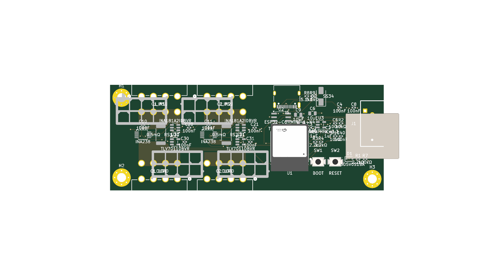

# Full-stack pipeline run-through — results (2026-06-11)

> **Remote-viewable** results of the first end-to-end run with a model in every seat (`scripts/cec_fullstack.py`), on `eps-8pin`, 8 rounds. Source artifacts alongside this file in [`docs/fullstack-run-2026-06-11/`](.). Driver + tiers: README §8 of the in-loop audit, with the 2026-06-11 local-minimum lessons baked in (rule cap, novelty gate, CL-24 verifier on every proposal). Companion: [the in-loop audit morning bundle](../inloop-audit-2026-06-11/MORNING-BUNDLE.md).

Branch `claude/fullstack-cl24` · run `13:17→13:39 CT` · 8 rounds · ~2.8 min/round.

---

## 1. Verdict — infra works end-to-end; GPU contention starved the model tiers

**The pipeline ran 8 rounds with zero crashes and every fail-safe held** — each tier that couldn't run degraded gracefully (skipped/fell back) instead of killing the run. That is the primary structural result. But the *honest* read is mixed, and splits cleanly:

- **What worked (and is the headline):** the **CL-24 verifier did exactly what Decision 9 designed it to do** — it discriminated, refused un-actuatable proposals, and held rule growth to **1 → 4** over 8 rounds (last night: 1 → 83), while *improving* rule quality. The morning's structural fixes (power pours, layer policy, FEM) all held.

- **What didn't fire:** **5 of ~10 tiers got no real live run** — the model intent manager (swap-starved), the V4 deep auditor (idle-reaped), GR-02 (never triggered), and vision + briefed reviewer (gated out by no clean board). The deterministic + host-Sonnet tiers ran; the local-GPU-model tiers mostly didn't.

- **What it tells us:** the bottleneck has moved. The *audit machinery* is no longer the problem — **GPU choreography** (the broker swap-thrashed cec-worker against V4 and the extractor eval) and **convergence to a gate-passing board** are. No candidate reached DRC=0 in 8 rounds → **0 gate-passing, 0 Pareto finalists.**

---

## 2. Did each tier actually fire live?

| Tier | Seat | Live this run? | Notes |
|---|---|---|---|
| T1 intent manager | cec-worker (model) | **0/8** ❌ | timed out every round (180s) → static-dict fallback. GPU swap-churn starved it. The model-managed assisted router was **not** exercised. |
| T2/T3/T3.5 route+score+FEM | deterministic + container | 8/8 ✅ | pours laid, gates scored, FEM `max_T` reported every round |
| T4 worker panel | cec-worker (3 lens) | partial | real 3-lens votes some rounds (r4/r8 escalate); fell back to deterministic when worker calls lost the GPU |
| T5 Sonnet auditor | Sonnet (host) | 8/8 ✅ | no GPU contention (host `claude -p`); proposed every round |
| CL-24 verifier | cec-worker ×3 charters + Sonnet arb | 26 calls | discriminated (4 inject / 3 refute); some charter seats timed out on swap-churn |
| T0 placement actuator | GR-02 (deterministic) | **0** | never triggered — kelvin held 7/8 so the stall counter never reached K=3 |
| T6 vision judge | cec-vision-judge | **0** | no Pareto finalist to inspect |
| T7 briefed reviewer | cec-manager-fast | **0** | no Pareto finalist to review |
| T8 V4 deep batch | deepseek-v4-flash | **0 live** ❌ | both batches (r4, r8) 502'd — V4 idle-reaped (30-min timer) after warm-up. Fail-safe skipped cleanly. |
| T9 ledger / DF-01 | deterministic | 8/8 ✅ | every round ledgered; accepted injections logged as ratification candidates |

---

## 3. The win — the CL-24 verifier earned its seat

This was the point of Decision 9, and it is the one tier that worked as designed. The verifier ran an adversarial 3-charter panel (spec-conformance / evidence-provenance / actuation-space) on every auditor proposal and **refused the ones no loop lever could act on**:

- **Rule growth 1 → 4** (vs **1 → 83** on the unguarded in-loop run). Verifier verdicts: ['uncertain', 'uncertain', 'refute', 'refute', 'uncertain', 'uncertain', 'uncertain', 'refute'].

- **It refuted with correct reasoning.** Round 3, the actuation-space charter (verbatim):

  > *"Increasing the unconnected metric weight will not resolve the stubs or unconnected ratlines"* — `failure_class: placement` → **refute**.

  That is the exact lesson from the local-minimum run: a placement-class failure mispriced as a scorer penalty. Last night it was injected; this run it was blocked.

- **Quality, not just volume.** The 4 rules that *survived* the gate are concrete loop levers, not session-scoped epicycles:

  1. When ≥2 FEM over-temp flags target SENSEC*_HI or SENSEC*_LO nets, trigger power-pour expansion on those nets (widen corridor keepout and add B.Cu mirror pour if absent) before accepting the candidate.
  2. When kelvin_unrouted >= 1, increase router optimization passes by 50% for the failing cable's net group and widen the shunt corridor keepout for that cable by 0.5 mm on each lateral side to open a cle
  3. When a via over-temp FEM flag targets any SENSEC* net, reduce the stitch-via pitch in that cable's power-pour via field by 50% (halve the inter-via spacing) before the next route pass, distributing cu
  4. When n_stubs >= 5 and stub nets include /CAN_H, /I2C_SCL, or /I2C_SDA, increase router optimization passes for those nets by 40% and apply GR-02 single-net U-detour repair on each stubbed control net 

Contrast the in-loop run's tail rules (`double_blindness_bypass_armed`, `consecutive_rule46_suppression_count`…). The guardrail moved the output from un-actionable meta-counters to ratifiable physical actuations.

---

## 4. What held (the morning fixes)

- **Power pours: 4 every round** — the regression fix is solid; the 12V SENSEC nets are poured, not stitched as thin traces.

- **`plane_signal_mm` = 0 every round** — layer policy holds; no plane-carving regression.

- **Kelvin gate: 7/8** (one blip, round 2) — vs **0/117** on the in-loop run.

- **FEM advisory fired every round** — `max_T` 99.0–118.7 °C with 4–5 over-temp flags, surfaced into the record + Pareto axis, never gating (AM-04 debt honored).

---

## 5. What didn't fire, and why

- **Intent manager (the assisted router) — 0/8.** Every `cec-worker` intent call hit its 180s timeout and fell back to the static dict. Root cause: the broker swap-thrashed cec-worker against V4 (my mid-run relaunch) and the gpt-oss extractor eval, so the call never got the GPU in time. **The headline feature was not tested live.** Fix: swap-aware timeout (~420s) + pre-warm/pin the model for the routing window + don't run a competing eval concurrently.

- **V4 deep batch — 0 live.** Both batch checkpoints 502'd: V4's 30-min idle-reaper stopped it between my warm-up and the round-4/round-8 calls. The deep 'D' seat of the A+D verifier design produced nothing. Fix: keep V4 resident for the run window, or schedule the batch immediately after a guaranteed warm.

- **Vision (T6) + briefed reviewer (T7) — 0.** Both are finalist-gated; with no gate-passing board there was no Pareto finalist to inspect/review. Not a failure of those tiers — a consequence of convergence.

- **GR-02 placement actuator — 0.** Fires on a Kelvin stall (K=3 consecutive) or placement attribution; kelvin held 7/8 so the stall never accumulated, and the one placement-attributed round (3) had kelvin passing.

- **No gate-passing board.** DRC bounced 19–41, never 0. A single FR pass/round at passes≤60 doesn't close DRC on this board; needs the GR-02 actuation to land or a harder convergence loop.

---

## 6. The board (final candidate, round 8)

Gates fail on DRC (29) + 5 unconnected; kelvin passes, pours present, plane clean.

---

## 7. Convergence series

Full: [`measurement.jsonl`](./measurement.jsonl).

| R | intents | passes | panel | kelvin | DRC | unconn | max_T | pours | verifier | rules |
|---|---|---|---|---|---|---|---|---|---|---|
| 1 | fallback | 32 | repair | true | 39 | 3 | 113.0 | 4 | uncertain | 1 |
| 2 | fallback | 40 | repair | false | 41 | 6 | 105.6 | 4 | uncertain | 2 |
| 3 | fallback | 48 | repair | true | 19 | 2 | 116.2 | 4 | refute | 2 |
| 4 | fallback | 60 | escalate | true | 24 | 2 | 99.0 | 4 | refute | 2 |
| 5 | fallback | 60 | repair | true | 38 | 3 | 110.5 | 4 | uncertain | 3 |
| 6 | fallback | 60 | repair | true | 34 | 2 | 117.7 | 4 | uncertain | 4 |
| 7 | fallback | 60 | repair | true | 38 | 2 | 118.7 | 4 | uncertain | 4 |
| 8 | fallback | 60 | escalate | true | 29 | 5 | 116.8 | 4 | refute | 4 |

---

## 8. Actionable next steps (ranked)

1. **GPU choreography for the run window.** Pre-warm + pin cec-worker; keep V4 resident (or disable its reaper) for the duration; never co-schedule the extractor eval during routing. This alone unblocks T1, T4 reliability, the verifier charter seats, and T8.

2. **Swap-aware seat timeouts** (~420s) so a model call that triggers a ~90s swap doesn't lose its own race.

3. **Converge to a clean board** — wire the GR-02 actuation to actually fire (lower the stall K, or trigger on DRC-plateau not just kelvin-stall), so DRC reaches 0 and the finalist tiers (vision, reviewer) finally get exercised.

4. **Ratify the 4 surviving rules** — unlike the in-loop tail, these are concrete and sourced; they belong in the DF-01 review queue (ledger `fullstack-candidate`).

---

## 9. Artifact index

| File | What |
|---|---|
| [`bundle.json`](./bundle.json) | final tally + the 4 rules + all injections |
| [`measurement.jsonl`](./measurement.jsonl) | per-round series (8 rows) |
| [`live-rules.json`](./live-rules.json) | evolving penalties + rules |
| [`findings/`](./findings) | per-round Sonnet auditor + V4 batch (both skipped:502) |
| [`verifier/`](./verifier) | per-round CL-24 charter verdicts + arbiter |
| [`intents/`](./intents) | per-round intents (all `fallback` — static) |
| [`gr01-grid.json`](./gr01-grid.json) | the congestion grid (20 hotspots, contested nets) |
| [`final-board-r8.png`](./final-board-r8.png) | final routed candidate |

_Generated from bundle.json + measurement.jsonl. Run: `python3 scripts/cec_fullstack.py --board eps-8pin --rounds 8`. 0 gate-passing / 0 finalists / 4 rules / verifier 26/200._
