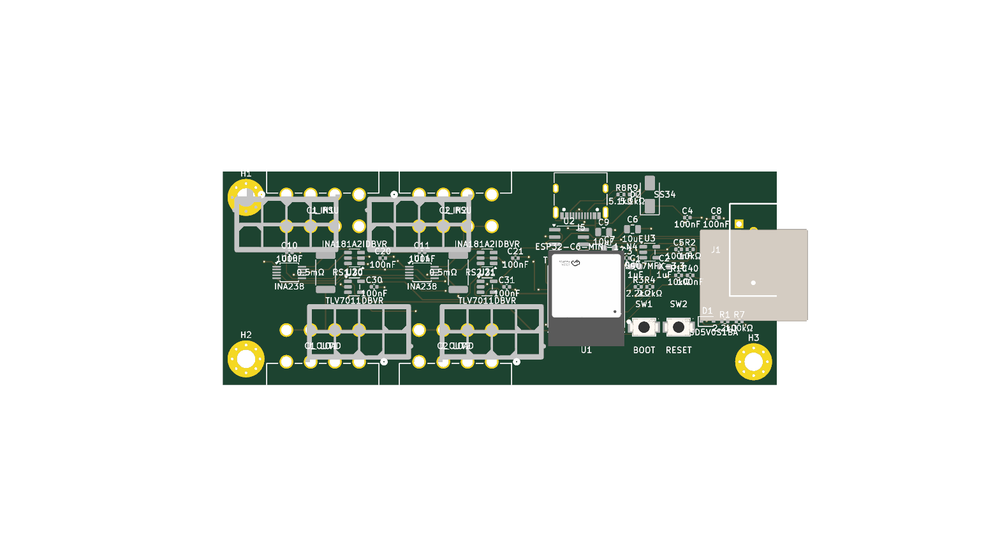

# Morning bundle — in-loop self-correcting audit (2026-06-11)

> **Remote-viewable summary** of the overnight in-loop audit experiment on `eps-8pin`. Renders on GitHub. Source artifacts live alongside this file in [`docs/inloop-audit-2026-06-11/`](.). Full background + design: [`README.md`](./README.md).

Branch `claude/corpus-experiential-intake` · run `2026-06-11 03:05→10:05 CT` · 117 rounds · fast auditor seat = **Sonnet every round** (V4 deep checkpoints were probe-only / morning-pass; see README §4).

---

## 1. Convergence verdict — what actually happened

The experiment asked one question (README §1): does an auditor compiled back into the manager and scorer mid-run **(a) collapse into a degenerate local minimum**, or **(b) produce genuinely usable corpus entries that move the physical metrics**?

The bundle's auto-label is `convergence_verdict: "productive"`. **The measured series says the honest answer is (a), the local minimum** — with two real positives that are the experiment's actual payoff. Read the numbers, not the label:

| Signal | Round 1 | Round 60 | Round 117 | Reading |
|---|---|---|---|---|
| Manager rules standing | 1 | 43 | **83** | monotonic pile-up |
| Injected penalty total | 1,105.0 | 2,575.0 | **3,253.5** | ~3× inflation |
| `base_objective` | 26,452.5 | 36,354.5 | 31,452.8 | no downward trend (floor ~19,353.2) |
| structural DRC | 26 | 36 | 31 | bounced 19–58, no trend |
| `plane_signal_mm` | 0 | 0 | 0 | **the one hard fix held all night** |
| `kelvin_ok` | false | false | false | **never closed (0/117 rounds)** |
| gates_pass | false | false | false | **0/117** |

**The local-minimum signature is textbook:** penalties and rules inflate monotonically while every physical metric (kelvin gate, DRC) plateaus and never improves. 117 rounds, **0 gate-passing candidates**, Pareto front **empty** (`pareto_finalists: 0`). The Kelvin sense pair never routed once. 93 distinct boards over 117 rounds (24 repeats) — so it isn't literally re-emitting one board, but the *metric* is pinned: the loop spent the night writing 83 increasingly baroque rules (`double_blindness_bypass_armed`, `consecutive_rule46_suppression_count`, up to `Rule 66`) around a gate it has no lever to close.

**The two real positives (why this run was worth it):**

1. **The guardrail held perfectly.** Every injection was additive-only; **16 proposals were rejected or no-op'd** (incl. the self-test catching a sign-confused `weight:-0.8` that would have *rewarded* a bad metric). No ratified bound was ever relaxed. The anti-ratchet firewall (DF-05) is proven under 7h of live pressure.

2. **The one structural fix held.** The FR-04 layer policy (deny plane layers to the router + price `plane_signal_mm`) kept plane-carving at **0 mm every single round** — the exact return-path destruction that originally needed a human in the loop never recurred. That fix belongs in the corpus; the 83 epicycle rules do not.

**Conclusion for the corpus:** this confirms the §8 lesson — *an auditor that can only inflate pricing/rules, with no actuation lever for the actual failure class, converges to a degenerate rule-epicycle minimum.* The usable signal is structural fixes (layer policy) and the guardrail; the 83 manager rules are **not** ratifiable as-is. See the driver changes already queued in README §8 (actuation-space check, novelty gate, rule cap, worker-swarm drives effort).

---

## 2. The routed board (final candidate, round 117)

Per-layer vector views (SVG, render in browser): [F.Cu](./layers/eps-8pin-r117-F_Cu.svg) · [B.Cu](./layers/eps-8pin-r117-B_Cu.svg) · [GND plane](./layers/eps-8pin-r117-GND.svg) · [12V plane](./layers/eps-8pin-r117-12V.svg) · [Edge.Cuts](./layers/eps-8pin-r117-Edge_Cuts.svg)

---

## 3. Owner questions from the morning review

### Q1 — "This is why we need the routing intent tier."

**Confirmed, and the board is the exhibit.** The signal traces visibly route *through* the sense region instead of around/under it. There is no model in this run deciding routing intent — the night used a **static `INTENTS` dict** (3 hand-written waypoint sets for `/CAN_H`, `/I2C_SDA`, `/I2C_SCL` in `cec_overnight_directed.py`). Nothing told the router "the sense window is sacred; detour the CAN/I2C around it." That is exactly the **intent-manager tier** (README §8, tier 1): a model seat reads the congestion grid + the prior round's failures and *emits* the FR-02 relational waypoints each round (`gr01_to_fr02_intents()`), replacing the static dict. The FR-02 waypoint mechanism to *execute* such an intent already exists and is fixture-verified; what's missing is the model **writing** the intent. This run is the motivating failure for building tier 1.

### Q2 — "We're regressing on the pour front. Did we have that ruleset in for the run?"

**No — and your read is exactly right.** The power-pour synthesis step was **not** wired into this run. `cec_overnight_directed.route_directed()` calls `cec_fr.import_ses(baked, ses, routed)` **without the `power_pours` argument**, and never calls `add_power_pours()` / `derive_power_pours()` / `synthesize_power_copper()`. So Freerouting is left to stitch the 12V pins together as individual thin traces — "as if the pour isn't connecting them anyway," precisely because no pour is ever laid. The whole *high-current-is-copper-area-not-fat-traces* design (the pour-**after**-route additive step from the 2026-06-06/09 work) is absent from this lean driver. It exists and is verified in `cec_router.route()` / `cec_fr.route_once()`, but the overnight-directed pipeline the in-loop audit rides on top of skipped it. **This is a wiring regression in `cec_overnight_directed`, not a loss of the capability.** README §8 tier 2 already lists "power pours at import" as required for the full-stack night — this run predates that wiring. Fix is a one-line plumb of `power_pours=derive_power_pours(...)` through `route_directed → import_ses`.

### Q3 — "Are we implementing the same congestion-based intent-aware placer from the impl doc?"

**Partially built, not yet wired — and the placer half is not built at all.** Status by piece:

- **GR-01 congestion grid (detection):** *built* as `cec_router.gr01_congestion_grid()` (RUDY-style per-cell demand from unrouted-net airwire bboxes + hotspot flagging, `cec_router.py:1216`). Standalone and tested.

- **GR-01 assignment → FR-02 intent compilation (`gr01_to_fr02_intents()`):** *not built.* This is the half that turns the grid's contested-net calls into directed corridor/layer waypoints and routes contested nets first. The night ran the **static `INTENTS` dict** instead — so the congestion grid never actually drove the route. README §8 tier 1 names this as the next build.

- **Congestion-aware *placement* (impl-doc P2: place against the GR-01 grid, `closed-loop-implementation-list.md` lines 1519–1520):** *not implemented.* Placement was fixed all night; the loop has no placement actuator yet. README §8 tier 0 queues a deterministic placement actuator (`cec_loop` kelvin_tighten + GR-02 repair battery) as the first thing to add — which is also the direct fix for the local minimum in §1 (the unclosable Kelvin gate is a **placement-class** failure the auditor kept mispricing as a scorer problem).

So: the detection grid exists, but the intent-compilation and the congestion-aware placer that the implementation doc drafts are **not** in this run. They are the explicit next steps.

---

## 4. Final scorer penalties (live-rules at round 117)

| Metric | Weight | Note |
|---|---|---|
| `plane_signal_mm` | 50.0 | FR-04 fix — the one ratifiable structural pricing |
| `drc` | 200.0 | raised 75→200 over the night |
| `unconnected` | 1000.0 | raised 450→1000 (dominant objective term) |
| `kelvin_unrouted` | 1000.0 | hard-gate proxy |
| `gate_fail` | 1000.0 | hard-gate proxy |
| `vias` | 3.0 | base |
| `length` | 0.5 | added round 107 (0→0.5) |

> The `unconnected`×1000 + `kelvin_unrouted`×1000 + `gate_fail`×1000 terms dominate the objective (~3000 of every candidate's score), which is *why* the auditor kept inflating them — and why inflation changed nothing: the router had no lever to satisfy the gate, so a higher price just scaled an unmovable term.

---

## 5. Ratification candidates (DF-01 log) — 101 total

The bundle inlines the most recent **40** (10 penalty raises, 30 manager rules). The full set of 101 is in [`live-rules.json`](./live-rules.json) and [`findings/`](./findings). **None are auto-promoted** — this is the owner ratification queue.

**Recommendation:** ratify **none of the 83 manager rules** as standing corpus — they are the rephrased-epicycle pile-up the experiment was built to detect. Ratify instead the **two structural learnings** (layer-policy pricing, already landed in code; and the actuation-space / novelty-gate / rule-cap driver changes in README §8). Keep the candidate log as evidence for the convergence finding.

Inlined candidates from the bundle (click to expand)

- **r75** · rule (accepted:added) — Extend Rule 37's net_absorption_count accounting to include spur-trimming events: after each round in which the trimmed_spurs counter is greater than zero, inspect the per-stub records produced by the spur-trimmer to identify the specific n…
- **r76** · rule (accepted:added) — Maintain a gate-aware fast-track exclusion path using the session-scoped net_absorption_count data tracked by Rules 37 and 38. At the start of each round's compiler invocation: if kelvin_unrouted > 0 in the immediately preceding round's res…
- **r77** · rule (accepted:added) — Maintain a session-scoped integer counter 'consecutive_total_elimination_with_kelvin_active'. At the end of each round: if (absorbed + trimmed_spurs + removed_orphans >= n_stubs AND n_stubs > 0 AND kelvin_unrouted > 0 in that round's result…
- **r78** · penalty `unconnected` 450.0→550.0 (accepted:raised) — Raise from 450 to 550: in this round 3 of the 4 unconnected ratlines are Kelvin sense nets (/SENSEC1_HI, /SENSEC1_LO, /SENSEC2_HI), each of which directly blocks a hard gate. The per-unit cost of an unconnected ratline has grown because the…
- **r78** · rule (accepted:added) — When round R's failing_reasons contains Kelvin net unconnected-ratline entries for two or more distinct cable indices simultaneously — where at least one cable C_sym has BOTH its /SENSEC{C_sym}_HI and /SENSEC{C_sym}_LO members failing (symm…
- **r80** · rule (accepted:added) — Maintain a session-scoped boolean flag 'double_blindness_bypass_armed'. At the end of each round R, if ALL of the following hold simultaneously: (a) compiler_zero_failing_net_overlap fired for round R (the compiler's nets list had zero over…
- **r81** · penalty `drc` 75.0→100.0 (accepted:raised) — Raise drc penalty from 75 to 100. With drc=23 contributing 1725 to the objective alongside a Kelvin+gate total of 2000 (kelvin_unrouted*1000 + gate_fail*1000), the DRC term is large enough that when DRC conflicts and Kelvin routing compete…
- **r81** · rule (accepted:added) — Maintain a session-scoped integer counter 'consecutive_double_blindness_bypass_kelvin_failures'. After each round R dispatched under an active double_blindness_bypass_armed=True flag (Rule 41): if kelvin_unrouted > 0 in round R's result, in…
- **r83** · rule (accepted:added) — When kelvin_unrouted > 0 in round R's result AND the compiler's candidate pool — after applying all normal exclusions from Rules 37, 38, and 39 — consists EXCLUSIVELY of nets whose net_absorption_count >= 3 (i.e., every net remaining in the…
- **r84** · rule (accepted:added) — Maintain a session-scoped per-cable integer counter 'consecutive_symmetric_kelvin_failure[C]'. After each round R: if BOTH /SENSEC{C}_HI and /SENSEC{C}_LO appear in failing_reasons with 'has unconnected ratlines', increment consecutive_symm…
- **r85** · penalty `drc` 100.0→120.0 (accepted:raised) — DRC=38 alongside kelvin_unrouted=1 indicates FR is packing non-Kelvin tracks through the cable-1 shunt approach zone, producing geometry violations that block the Kelvin escape. The current 100/violation penalty contributes 3800 to this can…
- **r85** · rule (accepted:added) — Pre-bypass shunt-proximate DRC clearance: immediately before dispatching any absorber-bypass round mandated by Rule 40 or Rule 41 — when the bypass is triggered, kelvin_unrouted > 0, AND the most recent completed round's structural DRC coun…
- **r86** · rule (accepted:added) — Maintain a session-scoped boolean flag 'absorber_false_positive_bypass_armed'. After each round R: compute inferred_non_kelvin_unconnected = unconnected[R] minus (count of distinct Kelvin member net names appearing in failing_reasons[R] wit…
- **r89** · penalty `unconnected` 550.0→700.0 (accepted:raised) — Cable 2's asymmetric Kelvin failure (/SENSEC2_HI unrouted) does not register in kelvin_unrouted because that metric requires both pair members to be unrouted to increment. Its sole scoring pressure comes through the unconnected ratline coun…
- **r89** · rule (accepted:added) — Maintain a session-scoped integer counter 'consecutive_high_drc_kelvin_stall'. After each round R: if structural DRC > 20 AND kelvin_unrouted > 0, increment the counter; otherwise reset it to 0. When the counter reaches 5: (1) query all str…
- **r90** · rule (accepted:added) — Maintain a session-scoped integer counter 'consecutive_dual_cable_symmetric_kelvin'. After each round R: if ALL FOUR of /SENSEC1_HI, /SENSEC1_LO, /SENSEC2_HI, and /SENSEC2_LO appear in failing_reasons with 'has unconnected ratlines' in the…
- **r91** · rule (accepted:added) — Maintain a session-scoped integer counter 'consecutive_near_threshold_drc_kelvin'. After each round R: if structural DRC >= 15 AND structural DRC <= 20 AND kelvin_unrouted > 0, increment the counter; otherwise reset it to 0. When the counte…
- **r92** · rule (accepted:added) — Maintain a session-scoped per-net integer counter 'consecutive_rule46_suppression_count[net]'. After each round R where Rule 46 fires: for each net name in round R's compiler nets list, increment consecutive_rule46_suppression_count[net] by…
- **r93** · penalty `unconnected` 700.0→800.0 (accepted:raised) — Raising from 700 to 800. The asymmetric Kelvin failure for cable 2 (SENSEC2_HI unrouted, SENSEC2_LO routed) contributes to the unconnected count but contributes 0 to kelvin_unrouted, which only counts symmetric pairs. The unconnected metric…
- **r93** · rule (accepted:added) — Detect and force-inject for ASYMMETRIC Kelvin failures. After evaluating round R: for each cable index C, if exactly one member of the pair (/SENSEC{C}_HI or /SENSEC{C}_LO) appears in failing_reasons with 'has unconnected ratlines' while th…
- **r94** · penalty `drc` 120.0→140.0 (accepted:raised) — DRC has persistently sat in the 15-20 range across recent rounds (rounds 89, 91, 94 all show DRC >= 15) despite the existing 120.0/hit penalty. A modest 17% increase to 140.0 strengthens candidate-selection pressure toward lower-DRC outcome…
- **r94** · rule (accepted:added) — Detect and serialize Rule-33 + Rule-50 co-firing. After evaluating round R: if Rule 33 fires for cable index C_sym (both /SENSEC{C_sym}_HI and /SENSEC{C_sym}_LO appear in failing_reasons with 'has unconnected ratlines') AND Rule 50 also fir…
- **r96** · penalty `drc` 140.0→175.0 (accepted:raised) — Raising drc penalty from 140→175 increases selection pressure against structurally congested routes. DRC=36 is persistently co-elevated with Kelvin failures across many rounds, indicating geometric conflict near shunt clusters is both a DRC…
- **r96** · rule (accepted:added) — Detect Rule-46 + Rule-51 co-fire and defer the Rule-46 absorber bypass by one round. After each round R: if Rule 46 fires (absorber_false_positive_bypass_armed set to True, with a non-empty compiler nets list) AND Rule 51 also fires in the…
- **r97** · penalty `drc` 175.0→200.0 (accepted:raised) — Modest increase from 175 to 200 (14%). At round 97, DRC=26 persists alongside Kelvin failure. The current 175/hit weight contributes 4550 to the objective but has not driven convergence toward DRC=0 across many rounds. A modest increase rai…
- **r97** · rule (accepted:added) — Resolve the Rule-52 vs Rule-34 compiler-suppression conflict in round R+2. When BOTH of the following are simultaneously active in a round designated R_2 by the Rule-52 protocol: (A) Rule 52 has stored a non-empty deferred_rule46_bypass_net…
- **r99** · rule (accepted:added) — Maintain a session-scoped variable 'session_min_drc' initialized to positive infinity. After each round R: (1) if round R's structural DRC < session_min_drc, update session_min_drc = round R's structural DRC and record 'session_min_drc_roun…
- **r100** · rule (accepted:added) — Detect Rule-46 + Rule-33-alone co-fire and defer the Rule-46 absorber bypass by one round (symmetric single-cable case, no Rule-50/51). After evaluating round R: if Rule 46 fires (all compiler stubs eliminated — n_stubs > 0 AND absorbed + t…
- **r106** · penalty `unconnected` 800.0→1000.0 (accepted:raised) — Cable 2's partially-routed Kelvin pair (tracks exist, ratlines remain) does not increment kelvin_unrouted, so its 2 unconnected Kelvin ratlines are penalized only at the generic unconnected rate. The kelvin_unrouted penalty (1000) does not…
- **r106** · rule (accepted:added) — After evaluating round R: if failing_reasons contains both '/SENSEC{C}_HI has unconnected ratlines' AND '/SENSEC{C}_LO has unconnected ratlines' for any cable index C, AND cable C is NOT counted in kelvin_unrouted (it has at least one track…
- **r107** · penalty `length` 0.0→0.5 (accepted:raised) — length=1139.24mm is currently unpenalized. Long indirect signal/control routes occupy the shunt exit corridors, increasing congestion around the cable-1 Kelvin escape path. A 0.5/mm weight (~570 points at this length) adds a compact-routing…
- **r107** · rule (accepted:added) — Maintain a session-scoped per-cable integer counter 'consecutive_kelvin_stall_rounds[C]' initialized to 0 for all cable indices C. After each round R: for each cable index C whose Kelvin pair is counted in kelvin_unrouted (both /SENSEC{C}_H…
- **r108** · rule (accepted:added) — Maintain a session-scoped counter `kelvin_keepout_escalation_count[C]` initialized to 0 for each cable index C. Each time Rule 56 fires for cable C (injecting the shunt-exit corridor keepout), increment `kelvin_keepout_escalation_count[C]`…
- **r109** · rule (accepted:added) — Maintain a session-scoped per-cable integer counter 'post_max_escalation_stall[C]' initialized to 0 for each cable index C. After each round R where kelvin_keepout_escalation_count[C] >= 10 (Rule 57 maximum tier, 12x16mm keepout geometry) A…
- **r110** · rule (accepted:added) — Amend Rule 58 step (2): when performing the post-max-escalation corridor ripup for cable C in round R, expand the track exclusion criterion to protect ALL Kelvin net members for ALL cable indices, not just cable C's pair. Specifically, repl…
- **r111** · rule (accepted:added) — Extend Rule 56's consecutive_kelvin_stall_rounds[C] counter to also increment for asymmetric single-member Kelvin failures. After each round R: if exactly ONE of /SENSEC{C}_HI or /SENSEC{C}_LO (but NOT both) appears in failing_reasons with…
- **r113** · rule (accepted:added) — Amend Rule 59 step (2) with a failing-route exception: when building the ripup exclusion set during cable C's corridor clearing (Rule 58), do NOT extend Rule 59 protection to a cross-cable Kelvin segment belonging to net /SENSEC{C'}_HI or /…
- **r114** · rule (accepted:added) — When Rule 46 fires in round R (n_stubs > 0 AND absorbed + trimmed_spurs == n_stubs AND kelvin_unrouted > 0, arming absorber_false_positive_bypass_armed with the compiler nets list) AND the count of cable indices C for which BOTH /SENSEC{C}_…
- **r116** · rule (accepted:added) — Maintain a session-scoped set 'compiler_excess_unconnected_targets' initialized to empty. After each round R: compute excess_unconnected = unconnected - (2 * kelvin_unrouted) - (count of cables C where exactly one of /SENSEC{C}_HI or /SENSE…
- **r117** · rule (accepted:added) — Maintain a session-scoped boolean flag 'rule66_slot_yield_active' initialized to false. After each round R where ALL of the following hold simultaneously: (a) Rule 46 fires (n_stubs > 0 AND absorbed + trimmed_spurs == n_stubs AND kelvin_unr…

---

## 6. Convergence series (sampled)

Full per-round series: [`measurement.jsonl`](./measurement.jsonl). Sampled every ~12 rounds:

| Round | passes | verdict | DRC | kelvin_ok | plane_mm | base_obj | penalty_total | rules |
|---|---|---|---|---|---|---|---|---|
| 1 | 24 | repair | 26 | false | 0 | 26,452.5 | 1,105.0 | 1 |
| 13 | 60 | repair | 25 | false | 0 | 25,551.8 | 2,400.0 | 13 |
| 25 | 60 | escalate | 26 | false | 0 | 26,453.0 | 2,400.0 | 23 |
| 37 | 60 | escalate | 41 | false | 0 | 41,452.6 | 2,425.0 | 30 |
| 49 | 60 | escalate | 41 | false | 0 | 41,454.2 | 2,575.0 | 39 |
| 61 | 60 | repair | 25 | false | 0 | 25,551.8 | 2,575.0 | 44 |
| 73 | 60 | repair | 27 | false | 0 | 27,454.7 | 2,578.0 | 52 |
| 85 | 60 | repair | 38 | false | 0 | 38,452.8 | 2,723.0 | 62 |
| 97 | 60 | repair | 26 | false | 0 | 26,451.0 | 3,053.0 | 71 |
| 109 | 60 | repair | 26 | false | 0 | 26,452.8 | 3,253.5 | 77 |
| 117 | 60 | repair | 31 | false | 0 | 31,452.8 | 3,253.5 | 83 |

---

## 7. Artifact index

| File | What |
|---|---|
| [`README.md`](./README.md) | Full experiment design, FR-04 origin, resume instructions |
| [`morning-bundle.json`](./morning-bundle.json) | Raw bundle (this doc's source) |
| [`measurement.jsonl`](./measurement.jsonl) | Per-round convergence series (117 rows) |
| [`live-rules.json`](./live-rules.json) | Evolving scorer penalties + all manager rules |
| [`findings/`](./findings) | Per-round auditor findings (Sonnet every round, V4 checkpoints) |
| [`run.log`](./run.log) | Orchestrator step log |
| [`layers/`](./layers) | Per-layer SVG renders of the final board |
| [`dashboard-board.png`](./dashboard-board.png) | Final routed-board render |

_Generated from `morning-bundle.json` (updated 2026-06-11T10:05:39). Verdict label in the raw bundle is `productive`; this summary's §1 gives the measured read._
